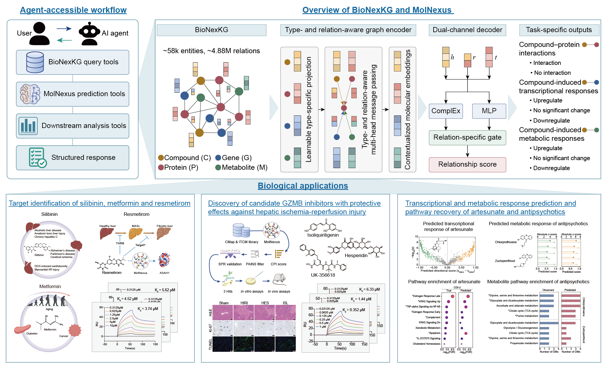

# Knowledge graph-enhanced multimodal embedding of molecular relationships

## Overview



- **BioNexKG** is a biomedical knowledge graph over compounds, proteins, genes, and metabolites.
- **MolNexus** provides CPI binary relationship prediction and three-class CGI/CMI prediction.
- **MolNexus Skill** exposes BioNexKG queries, MolNexus prediction, and pathway enrichment for use by an agent.

## Dependencies

- Python >= 3.10
- PyTorch >= 2.0
- PyTorch Geometric >= 2.5
- NumPy
- Pandas
- Scikit-learn
- Matplotlib
- GSEApy

## Quick installation

```bash
git clone https://github.com/ZJUFanLab/MolNexus.git
cd MolNexus
conda env create -f environment.yml
conda activate molnexus
```

## Usage

### BioNexKG Relationship Query

```bash
python skills/MolNexus/scripts/query_kg.py \
  --compound-id 46220502 \
  --kind target \
  --kg-file demo/BioNexKG_demo/BioNexKG_demo.csv \
  --limit 100
```

```bash
python skills/MolNexus/scripts/query_names.py \
  --gene-symbol FYN \
  --kg-file demo/BioNexKG_demo/BioNexKG_demo.csv \
  --compound-registry demo/reference_demo/query_compounds_with_aliases.csv \
  --protein-mapping demo/reference_demo/protein_genes_idmapping.tsv \
  --limit 100
```

### CPI Prediction

```bash
python skills/MolNexus/scripts/predict_cpi.py \
  --split DCS \
  --task-mode compound_screening \
  --compounds demo/input_demo/demo_screening_compounds.csv \
  --feat demo/input_demo/demo_screening_compounds_feat.csv \
  --candidate-file demo/input_demo/demo_screening_target.csv \
  --out-dir results/cpi/predict_cpi_demo \
  --execute
```

### CGI Prediction

```bash
python skills/MolNexus/scripts/predict_cgi.py \
  --input-csv demo/input_demo/demo_cgi_external.csv \
  --compound-features demo/input_demo/demo_external_compounds_feat.csv \
  --model-dir model/cgi \
  --input-format triplet \
  --compound-id-col head \
  --gene-id-col tail \
  --label-col relation \
  --output-dir results/cgi/predict_cgi_demo \
  --execute
```

Classes: `CGI-N` = no significant change, `CGI-D` = down-regulation, `CGI-U` = up-regulation.

### CMI Prediction

```bash
python skills/MolNexus/scripts/predict_cmi.py \
  --input-csv demo/input_demo/demo_cmi_external.csv \
  --model-dir model/cmi \
  --external-compound-features demo/input_demo/demo_external_compounds_feat.csv \
  --input-format triplet \
  --compound-id-col head \
  --metabolite-id-col tail \
  --label-col relation \
  --output-dir results/cmi/predict_cmi_demo \
  --execute
```

Classes: `CMI-N` = no significant change, `CMI-D` = down-regulation, `CMI-U` = up-regulation.

### Pathway Enrichment

Pathway enrichment uses observed `CGI-U` and `CGI-D` genes from BioNexKG.

```bash
python skills/MolNexus/scripts/pathway_enrichment.py \
  --compound-id 46220502 \
  --kg-file demo/BioNexKG_demo/BioNexKG_demo.csv \
  --outdir results/pathway_enrichment
```

### Model Training

Submit the five-fold training jobs with Slurm:

```bash
sbatch scripts/train_cpi.sh
sbatch scripts/train_cgi.sh
sbatch scripts/train_cmi.sh
```

## MolNexus Skill

The Skill is located at `skills/MolNexus/SKILL.md` and supports BioNexKG relationship queries, CPI/CGI/CMI prediction, and pathway enrichment of observed `CGI-U` and `CGI-D` genes.

Example agent requests:

```text
Use the MolNexus Skill to query known BioNexKG protein targets for abemaciclib.
```

```text
Use the MolNexus Skill to query BioNexKG compounds with known CPI relationships to the protein target corresponding to gene symbol FYN.
```

```text
Use the MolNexus Skill to perform pathway enrichment of observed CGI-U and CGI-D genes for compound CID 46220502.
```