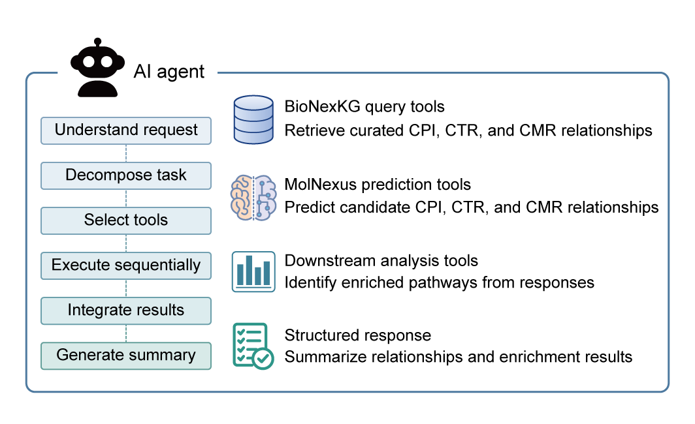

# MolNexus Skill



This directory contains the **MolNexus skill**, an agent-callable interface for **BioNexKG** and the **MolNexus molecular relationship prediction models**.

The skill provides three main capabilities:

* **BioNexKG query:** query known molecular relationships using compound names/CIDs or gene symbols.
* **Molecular relationship prediction:** perform CPI prediction and three-class CGI/CMI prediction (`up-regulation`, `down-regulation`, or `no significant change`).
* **Pathway enrichment:** perform Enrichr pathway enrichment for observed `CGI-U` and `CGI-D` genes associated with a compound in BioNexKG.

`SKILL.md` defines the agent instructions and workflow. Supporting scripts are located in `scripts/`, with detailed interface documentation in `references/`.

## Directory Structure

```text
MolNexus/
├── SKILL.md
├── scripts/
│   ├── query_kg.py
│   ├── query_names.py
│   ├── predict_cpi.py
│   ├── predict_cgi.py
│   ├── predict_cmi.py
│   └── pathway_enrichment.py
└── references/
    ├── kg_query.md
    ├── prediction_interfaces.md
    └── pathway_enrichment.md
```

For detailed usage and execution rules, please refer to `SKILL.md`.
